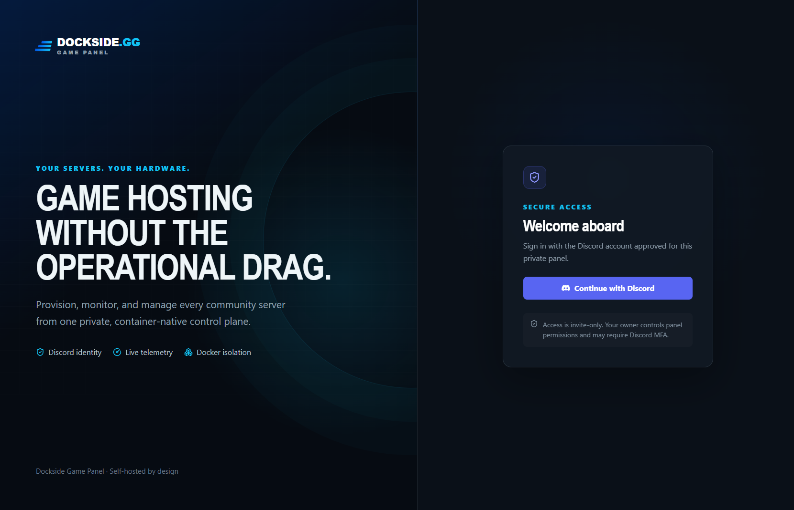
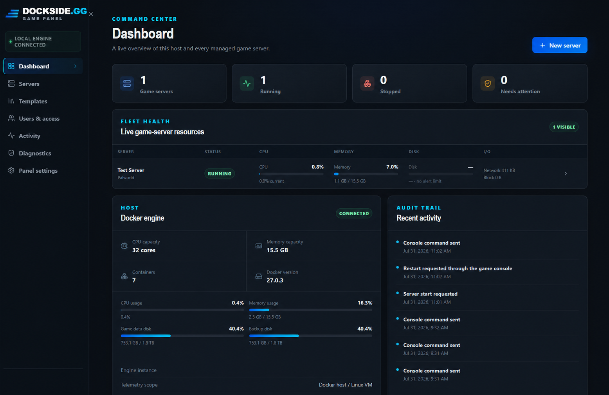
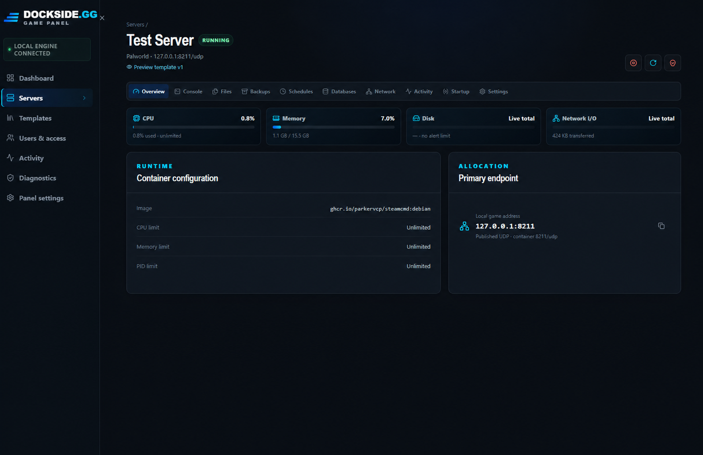
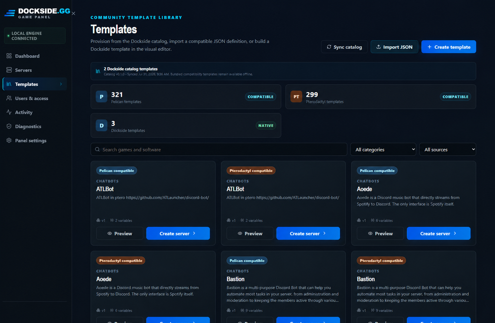
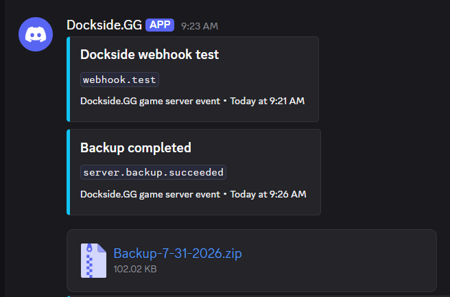

# Dockside.GG Game Panel

[](https://github.com/Dockside-GG/game-panel/releases)
[](LICENSE)


> [!CAUTION]
> **Early alpha software — not recommended for production use.** Dockside is actively being designed, tested, and changed. Features, migrations, container behavior, and storage formats may change without notice. Use a disposable test host and maintain independent backups. The project contributors and copyright holders are not liable for data loss, downtime, security incidents, lost revenue, or other damages arising from use of this software.



Dockside is a modern, Discord-first, Docker-native game server panel for gamers and gaming communities. It gives communities that already organize in Discord one private control plane for provisioning, monitoring, and managing their game servers.

Owners can invite Discord users with expiring single-use links, approve access, require Discord MFA, and grant panel-wide or per-server permissions without operating a separate identity system or Discord bot.

## Features

- 🎮 **Container-native servers** — provision and isolate game servers with start, stop, restart, kill, crash recovery, and desired-state reconciliation.
- 📊 **Live telemetry** — monitor host and per-server CPU, memory, disk, network, block I/O, process, and health data.
- 💻 **Real-time console** — follow installation and runtime output, then send commands through stdin, RCON, or template-defined REST transports.
- 📁 **File management** — upload files and folders by drag and drop, edit text files, rename entries, and download individual files or complete folders.
- 💾 **Backup and restore** — create, download, retain, schedule, restore, and checksum game-server backups with file-level include selection.
- 📤 **Discord backup delivery** — send completed backup ZIPs to a selected Discord channel as an additional off-host copy.
- 🔔 **Discord monitoring webhooks** — subscribe named webhooks to lifecycle, warning, error, restart, schedule, and backup events per server.
- ⏱️ **Cron schedules** — automate power actions, backups, console commands, delays, and notifications with concurrency and misfire policies.
- 🧩 **Template compatibility** — use Dockside-native templates or import compatible Pelican and Pterodactyl JSON definitions.
- 🛠️ **Template authoring** — build visually or in raw JSON, import/export definitions, create templates from servers, and publish immutable versions.
- 👥 **Discord access control** — use OAuth2 identity, expiring single-use invitations, owner-selectable MFA policy, and scoped roles.
- 🌐 **Safe networking** — declare internal-only or externally published ports, enforce one primary allocation, and reject conflicts.
- 🗄️ **Managed databases** — create private per-server PostgreSQL databases and rotate credentials.
- 🔐 **Separated privileges** — keep Docker socket access inside the isolated engine service rather than the internet-facing panel.

- 🔄 **Verified in-panel updates** — check Dockside.GG GitHub releases, verify SHA-256 checksums, create one rotating full recovery snapshot, update exact image tags, and automatically roll back failed health checks.

## A live view of the fleet

<table>
  <tr>
    <td width="50%">
      
      <br><strong>Fleet dashboard</strong><br>Host health, server usage, system containers, and audit activity in one view.
    </td>
    <td width="50%">
      
      <br><strong>Server control</strong><br>Resource meters, runtime settings, network allocations, and lifecycle actions per server.
    </td>
  </tr>
  <tr>
    <td colspan="2">
      
      <br><strong>Template library</strong><br>Search Dockside-native definitions alongside the bundled Pelican- and Pterodactyl-compatible libraries.
    </td>
  </tr>
</table>

## Discord monitoring and backup delivery

Configure named Discord webhooks per game server and select exactly which events each destination receives. Webhooks can report lifecycle changes, restarts, warnings, errors, schedules, and backup results.

Completed backup archives can also be delivered to a selected Discord channel:

<p align="center">
  
</p>

Discord delivery is an additional off-host copy, subject to Discord attachment and retention limits. It does not replace tested, independent backups of panel and game data.

## Template compatibility

Dockside ships release-bundled Pelican-compatible and Pterodactyl-compatible definitions as offline snapshots. The running panel does not fetch those definitions from Pelican or Pterodactyl websites. The separate public Dockside catalog contains only original Dockside-native templates and synchronizes from [Dockside-GG/game-panel-templates](https://github.com/Dockside-GG/game-panel-templates).

Every definition is normalized into an immutable Dockside canonical format. Bundled compatibility definitions and remote catalog definitions remain read-only; customizing one creates a local Dockside template that synchronization never overwrites. Dockside calls all of these definitions **templates**, not eggs.

Dockside is an independent project and is not affiliated with or endorsed by Pelican or Pterodactyl. See [Creating Dockside templates](docs/TEMPLATES.md) for the native specification and compatibility behavior.

## Installation

### Published alpha release

Release installation is for people testing a published Dockside build without editing the source.

1. Open [Releases](https://github.com/Dockside-GG/game-panel/releases) and download the versioned `dockside-game-panel-<version>.zip` or `.tar.gz` asset. Do not use GitHub's automatically generated source archive as the installer bundle.
2. Extract the archive.
3. Install Docker Desktop on Windows or Docker Engine with Compose v2 on Linux.
4. Create a Discord OAuth2 application and keep its client ID and client secret available.
5. Run the guided installer from the extracted directory.

Windows PowerShell:

```powershell
powershell -ExecutionPolicy Bypass -File .\scripts\install.ps1
```

Linux:

```bash
chmod +x scripts/*.sh
./scripts/install.sh
```

The installer reads the exact release version from the bundle, asks for the local or external panel URL, access mode, Discord credentials, MFA policy, game-port range, and storage locations, then generates the remaining secrets. It prints the exact Discord OAuth callback URI that must be added to the Discord application.

Read the complete [installation guide](docs/INSTALLATION.md) and [reverse-proxy guide](docs/REVERSE_PROXY.md).

### Development and contributing

Development mode builds the app, worker, and engine images from the checked-out source. Use the guided installer to generate secrets and select `dev` when prompted.

Windows:

```powershell
git clone https://github.com/Dockside-GG/game-panel.git
Set-Location game-panel
powershell -ExecutionPolicy Bypass -File .\scripts\install.ps1
docker compose --env-file .env -f compose.yml -f compose.dev.yml up -d --build
```

Linux:

```bash
git clone https://github.com/Dockside-GG/game-panel.git
cd game-panel
chmod +x scripts/*.sh
./scripts/install.sh
docker compose --env-file .env -f compose.yml -f compose.dev.yml up -d --build
```

Contributor commands, repository structure, database workflow, frontend workflow, and troubleshooting are documented in the [Developer README](docs/DEVELOPMENT.md).

## Architecture

Dockside uses:

- **Go** for the application API, background worker, and isolated Docker engine service.
- **React, TypeScript, Vite, and TanStack Query** for the web interface.
- **PostgreSQL** for identities, permissions, templates, servers, jobs, webhooks, and audit history.
- **Docker Engine and Compose** for the panel services and managed game workloads.
- **Caddy** as the bundled edge proxy, with support for an existing Nginx, Caddy, or Apache host.
- **Discord OAuth2** for identity.

Only the restricted `engine` service receives the Docker socket. The internet-facing application and background worker do not mount it. Game servers receive isolated networks and dedicated data paths.

Read [Architecture](docs/ARCHITECTURE.md) and [Security](docs/SECURITY.md) before contributing to privileged engine, authentication, archive, or authorization code.

## Project status and versioning

The first public target is `v0.1.0-alpha.1`. Versions below `1.0.0` remain early-development software and may contain documented breaking changes. Published container tags and release archives are immutable; source builds identify themselves as `dev`.

See [Versioning and releases](docs/VERSIONING.md), [Release process](docs/RELEASING.md), and the [changelog](CHANGELOG.md).

## Documentation

- [Installation](docs/INSTALLATION.md)
- [Developer README](docs/DEVELOPMENT.md)
- [Release process](docs/RELEASING.md)
- [Panel updates and recovery snapshots](docs/UPDATES.md)
- [v0.1.0-alpha.1 release notes](docs/releases/v0.1.0-alpha.1.md)
- [Contributing](CONTRIBUTING.md)
- [Versioning and releases](docs/VERSIONING.md)
- [Changelog](CHANGELOG.md)
- [Creating Dockside templates](docs/TEMPLATES.md)
- [Discord authentication](docs/DISCORD_AUTH.md)
- [Reverse proxies and shared web hosts](docs/REVERSE_PROXY.md)
- [Operations, backups, upgrades, and recovery](docs/OPERATIONS.md)
- [Architecture](docs/ARCHITECTURE.md)
- [Security model](docs/SECURITY.md)
- [Product and engineering plan](docs/PROJECT_PLAN.md)

Use the structured issue forms for reproducible bugs, feature proposals, and template-compatibility reports. Never include credentials, Discord webhook URLs, OAuth secrets, tokens, private server files, or other sensitive data in an issue.

## License

Copyright 2026 Dockside.GG contributors.

Licensed under the [Apache License 2.0](LICENSE).
