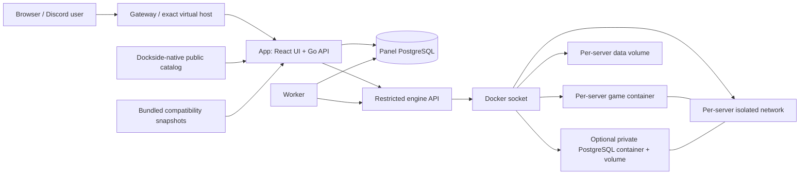

# Architecture

Dockside is a Go, React/TypeScript, PostgreSQL, Docker Compose, Caddy, and Discord OAuth2 application designed for gamers and Discord-based communities that host dedicated servers and game nights.

The architecture separates the internet-facing panel from Docker privileges:

- **App:** serves the embedded React UI and Go API, handles Discord login, sessions, CSRF, invitations, and authorization.
- **Worker:** processes provisioning, schedules, telemetry, crash recovery, backups, retention, and webhooks.
- **Engine:** the only service with the Docker socket; performs labeled container, network, volume, console, file, backup, and database operations.
- **PostgreSQL:** stores identities, permissions, immutable template versions, servers, encrypted secrets, jobs, and audit history.
- **Caddy gateway:** provides the bundled local or HTTPS edge and can be replaced by an existing reverse proxy.
- **Template sources:** release-bundled Pelican/Pterodactyl compatibility
  snapshots and the separate public Dockside-native catalog feed the same
  immutable canonical model.
- **Game workloads:** run in isolated Docker networks and named volumes with optional resource limits and private per-server databases.

Pelican- and Pterodactyl-compatible template JSON is normalized locally into Dockside's immutable canonical format. Dockside extensions add explicit networking, REST/RCON/stdin command transports, resource defaults, and backup defaults.

The app owns HTTP/authentication, validation, authorization, metadata, and audit writes. The worker claims durable outbox work with row locking. The engine exposes typed, authenticated operations and label-verifies every Docker resource before mutation.

Game servers have:

- One labeled runtime container.
- One named data volume mounted at `/home/container`.
- One isolated bridge network.
- Explicit host port bindings.
- Optional private PostgreSQL service reachable only as `dockside-db:5432` on that network.

At startup the app seeds the versioned, release-bundled compatibility snapshots
from local embedded data. It then attempts to fetch the Dockside-native catalog
over HTTPS, validates the catalog envelope and every normalized definition, and
replaces only remote catalog-managed Dockside rows in one serializable
transaction. A periodic sync repeats this process. Local Dockside templates are
separate records and cannot be overwritten by synchronization. A missing or
invalid remote catalog is surfaced in diagnostics but does not prevent startup.

The core runtime is deliberately game- and distribution-platform-neutral.
Installation scripts, images, environment variables, ports, health semantics,
and command transports belong to immutable templates. Game stdout/stderr is
streamed without message-specific interpretation; only failures originating in
the panel, worker, engine, or Docker control operations become structured panel
diagnostics.
