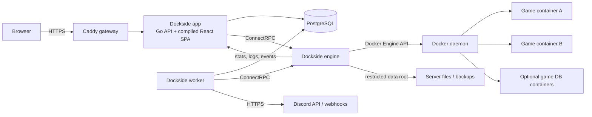

# Dockside Game Panel — Product and Engineering Plan

Status: proposed

Planning date: July 29, 2026

Product goal: make secure, self-hosted game-server management approachable for gamers and gaming communities.

## 1. Executive recommendation

Build Dockside Game Panel as a containerized, single-host control plane with:

- A dark-first Dockside.GG web application.
- Discord OAuth2 login and invite-only access.
- A Go API, worker, and Docker engine service built from one modular codebase.
- A React and TypeScript single-page application built with Vite.
- PostgreSQL as the only required database and coordination service.
- Caddy as the default TLS reverse proxy.
- One isolated Docker container per game server, plus optional managed database containers.
- A versioned Dockside template model that imports PTDL v2 and Pelican v1–v3 formats.
- Linux as the production platform and Windows 10/11 with Docker Desktop and WSL2 as a supported community/development platform.

The first release should deliberately remain single-host. External nodes, multi-host orchestration, billing, reseller features, and Kubernetes are out of scope. A host owner can install multiple independent panel instances, but each instance should have a unique domain, Compose project name, data root, instance ID, and non-overlapping port pool.

The architecture should be a modular monolith. API, background worker, and Docker engine are separate processes for security and failure isolation, but share domain code and a single versioned repository. This is simpler to install, test, and operate than a distributed microservice system.

## 2. Product principles

1. Safe by default: destructive and privileged actions require explicit permissions and confirmation.
2. Discord-first, not Discord-dependent for recovery: normal users authenticate through Discord; owners have a local CLI break-glass recovery flow.
3. One host, one control plane: do not reproduce a remote node/agent architecture in v1.
4. Containers are the isolation boundary: every game server runs separately with explicit resource, filesystem, and network limits.
5. Templates are data, not trusted code: imports are validated, versioned, attributed, scanned, and visibly assigned a trust state.
6. Reconcile desired state: the database records intent; the engine continually reconciles Docker to that intent.
7. Keep operational dependencies small: PostgreSQL replaces separate cache, queue, and scheduler infrastructure for v1.
8. Progressive disclosure: common operations are simple; advanced controls remain available without cluttering the main experience.
9. Capability-aware UI: hide or explain metrics and controls that a platform cannot reliably provide.
10. Audit every meaningful mutation: access, power, files, backups, schedules, templates, network, and settings changes must be attributable.

## 3. Scope

### 3.1 Version 1 scope

- Installation and first-owner claim flow.
- Discord OAuth2 authentication.
- Owner-controlled Discord MFA policy.
- Expiring single-use invite links, pending users, roles, and per-server permissions.
- Dashboard with host and game-server health.
- Game-server create, install, start, stop, restart, kill, reinstall, and full delete.
- Real-time console output and command input.
- File manager.
- Backups and restores.
- Cron schedules and preset schedule builder.
- Managed game databases.
- Port and network configuration.
- Startup variables, image selection, startup command, and resource limits.
- Per-server activity history.
- Per-server Discord and generic webhook destinations.
- Template catalog, import, export, creation, versioning, and deletion.
- PTDL v2 and Pelican v1–v3 import compatibility.
- Linux installation and update scripts.
- Windows 10/11 PowerShell setup for Docker Desktop/WSL2.
- GitHub Wiki-ready documentation stored in the repository.

### 3.2 Explicit non-goals for version 1

- Remote nodes or a Wings-style external agent.
- Kubernetes, Docker Swarm, or multi-host scheduling.
- Native Windows containers or Windows-only game-server images.
- Windows Server production support.
- Billing, subscriptions, reseller accounts, quotas across customers, or invoicing.
- Public registration.
- A general-purpose Docker management UI.
- Browser-based shell access to the host.
- Arbitrary host bind mounts, privileged containers, host networking, host PID/IPC namespaces, or device passthrough.
- A plugin execution system.
- A Discord bot or automated invitation DMs.

## 4. Recommended technology stack

Versions should be pinned to a tested minor/patch release in release manifests, not to `latest`.

| Layer | Recommendation | Reason |
|---|---|---|
| Backend | Go 1.26.x | Excellent Docker SDK support, low memory use, simple static binaries, strong concurrency, and a good fit for streams and host telemetry. |
| HTTP API | Go standard library with Chi or Huma | Small surface area; middleware and OpenAPI without a heavyweight framework. Select one in ADR-003 after a short prototype. |
| Internal engine protocol | ConnectRPC/protobuf over an internal network | Typed, versioned contracts and streaming support without operating a separate message broker. |
| Frontend | React 19.2.x, TypeScript, Vite 8.1.x | Modern, fast client application with no SSR requirement for an authenticated operations panel. |
| Routing/data | TanStack Router and TanStack Query | Typed routes, server-state caching, invalidation, and optimistic interactions. |
| UI primitives | Radix UI plus a locally owned component layer | Accessible behavior without adopting a visually opinionated framework. |
| Styling | Tailwind CSS plus CSS design tokens | Rapid implementation while keeping Dockside brand values centralized. |
| Forms/validation | React Hook Form and generated schema types | Efficient complex provisioning and template forms. |
| Console/editor | xterm.js and Monaco Editor | Mature terminal rendering and code/config editing. |
| Charts | uPlot or lightweight-charts | Efficient frequent time-series updates; avoid a large dashboard chart bundle. |
| Database | PostgreSQL 18.x | Durable relational state, JSONB where appropriate, advisory locks, notifications, and job coordination. |
| SQL access | pgx plus sqlc | Explicit SQL, compile-time generated Go types, predictable performance, and reviewable migrations. |
| Migrations | Goose or Atlas in migration-only mode | Ordered, repeatable schema evolution. Choose one and do not mix tools. |
| Queue/outbox | PostgreSQL job table with `FOR UPDATE SKIP LOCKED` | Eliminates Redis/Valkey from the required installation while preserving retries and worker concurrency. |
| Reverse proxy | Caddy 2.x | Automatic HTTPS and a compact default configuration. Existing reverse proxies remain supported. |
| Container API | Official Docker Go SDK | Typed Docker Engine operations and streaming stats/logs/events. |
| Observability | Structured JSON logs and OpenTelemetry | Standard logs, traces, and internal metrics with optional external export. |
| Build/release | Docker BuildKit/buildx, GitHub Actions | Multi-architecture images, caching, SBOMs, signing, and reproducible release artifacts. |
| Monorepo tooling | Go workspaces plus pnpm | Minimal tooling for backend and frontend packages. |

Why not Next.js: this is an authenticated, API-driven control panel with no SEO requirement. A Vite SPA is easier to serve from the Go application, avoids a Node production runtime, and reduces the installed service count.

Why not Node.js for the control plane: TypeScript would be viable, but Go is the stronger fit for long-running Docker streams, low-overhead metrics collection, tar/archive work, and a small self-hosted footprint.

Why not Rust: it could provide excellent performance and safety, but would increase implementation complexity and contributor friction without a material v1 benefit over Go.

## 5. System architecture



### 5.1 Required panel services

| Service | Publicly reachable | Docker socket | Responsibility |
|---|---:|---:|---|
| `gateway` | Yes, ports 80/443 | No | TLS, redirects, security headers, request size limits, WebSocket proxying. |
| `app` | Through gateway only | No | SPA assets, REST API, sessions, authorization, validation, WebSocket fan-out. |
| `worker` | No | No | Schedules, backups, webhook delivery, offline template-library package validation/import, retention, outbox processing. |
| `engine` | No | Yes | The only Docker client; lifecycle, console, files, archives, networks, limits, and telemetry. |
| `postgres` | No | No | Panel state, sessions, audit records, jobs, operations, metric rollups. |

Optional services should use Compose profiles:

- `otel-collector` for external observability.
- `game-mariadb`, `game-postgres`, or `game-redis` providers when a server requests a managed database.
- Development-only mail/webhook inspectors and test Docker daemon.

### 5.2 Docker network boundaries

- `edge`: gateway to app.
- `control`: app, worker, engine, and PostgreSQL; marked internal.
- `game-<server-id>`: one network per game server and its managed sidecars.
- The panel database never joins a game network.
- Game containers never join the control network.
- Only explicitly published TCP/UDP ports bind to the host.
- The engine rejects host networking, additional control-network attachments, arbitrary DNS settings, and arbitrary host paths.

### 5.3 Managed object identity

Every managed Docker object receives immutable labels:

- `gg.dockside.managed=true`
- `gg.dockside.instance=<installation UUID>`
- `gg.dockside.server=<server UUID>`
- `gg.dockside.kind=server|installer|backup-helper|database`
- `gg.dockside.template-version=<template version UUID>`

The engine may mutate only objects matching both its configured installation UUID and the requested server UUID. Panel system containers have `gg.dockside.system=true` and are never valid server targets.

### 5.4 Desired-state reconciliation

The database is the source of product intent; Docker is the runtime source of truth. Long operations use an `operations` table and idempotent reconciliation:

1. API validates authorization and input.
2. API writes desired state and an outbox event in one transaction.
3. Worker claims the event with an idempotency key.
4. Engine performs a narrow, validated action.
5. Engine reports runtime state and progress.
6. Worker commits success or a retryable/permanent failure.
7. Activity and audit events are emitted.

This avoids half-created servers and makes restarts safe.

## 6. Repository and clean architecture

Proposed repository:

```text
/
  cmd/
    app/
    worker/
    engine/
    dockside-cli/
  internal/
    auth/
    access/
    users/
    servers/
    templates/
    scheduler/
    backups/
    files/
    databases/
    networking/
    webhooks/
    telemetry/
    audit/
    operations/
    platform/
  pkg/
    contracts/
    templateformat/
  web/
    src/
      app/
      components/
      features/
      routes/
      design-system/
  api/
    openapi/
    proto/
  db/
    migrations/
    queries/
  templates/
    catalogs/
    schemas/
    fixtures/
  deploy/
    compose/
    caddy/
  scripts/
    install.sh
    install.ps1
    update.sh
    update.ps1
    backup-panel.sh
    backup-panel.ps1
  docs/
    architecture/
    install/
    operations/
    security/
    templates/
  tests/
    integration/
    compatibility/
    e2e/
```

Each backend domain should expose application commands/queries and interfaces. Docker, Discord, PostgreSQL, storage, and clocks are adapters. HTTP handlers must not contain business rules, and domain packages must not import HTTP or Docker types.

Use architecture-decision records for decisions that would otherwise drift:

- ADR-001: single-host modular monolith.
- ADR-002: Go backend and Vite SPA.
- ADR-003: public and internal API frameworks.
- ADR-004: PostgreSQL job queue and outbox.
- ADR-005: Docker socket threat boundary.
- ADR-006: canonical template format and compatibility policy.
- ADR-007: Linux production and Windows support tier.
- ADR-008: local/S3 backup storage contract.
- ADR-009: Discord MFA gate versus optional WebAuthn step-up.

## 7. Authentication, invitation, and recovery

### 7.1 First-owner claim

Do not make “first Discord user to sign in” the owner. That creates a race during a new public installation.

1. Installer creates an installation UUID and a high-entropy, single-use bootstrap token.
2. Only the token hash is stored.
3. Installer prints the token once with an expiration.
4. Owner completes Discord OAuth2 and enters the token.
5. The authenticated Discord ID becomes the immutable primary owner.
6. Token is consumed and the setup route closes.

Ownership transfer is a separate high-risk flow requiring current-owner reauthentication, target-user acceptance, and a recovery code.

### 7.2 Discord OAuth2

- Use the authorization-code flow with an exact registered redirect URI.
- Always generate and validate a cryptographically random `state`.
- Request only `identify`; request `email` only if a later product requirement justifies it.
- Exchange the code only from the backend.
- Fetch `/users/@me`, upsert the Discord identity, then discard the access token unless a feature explicitly needs it.
- Never place Discord tokens in local storage or frontend JavaScript.
- Reject bot/system accounts.
- Handle Discord rate limits and outages without weakening authentication.

Discord exposes `mfa_enabled` on the current user object for the `identify` scope. Store the latest observed value and timestamp, but check it again at each login.

Important limitation: `mfa_enabled=true` proves that the account has Discord MFA configured; it does not prove that Discord challenged the user with MFA during this particular login. The panel can correctly enforce “Discord MFA must be configured.” If the product later needs strong step-up proof for destructive actions, add panel-bound WebAuthn/passkeys.

### 7.3 Panel sessions

- Use an opaque random session token in a `Secure`, `HttpOnly`, `SameSite=Lax` cookie.
- Store only a hash of the token in PostgreSQL.
- Rotate the token at login, privilege change, ownership transfer, and step-up.
- Apply idle and absolute expiration, for example 8 hours idle and 24 hours absolute by default.
- Revoke all user sessions when access is suspended or MFA policy becomes unmet.
- Use CSRF tokens on mutations and verify `Origin`/`Host`.
- Use strict trusted-proxy configuration; never trust forwarded headers from arbitrary sources.
- Apply per-IP and per-account rate limits to login, invite, and destructive endpoints.

### 7.4 MFA policy

Policy levels:

- Off.
- Required for panel administrators.
- Required for users with power/console/file-write access.
- Required for everyone.
- Per-user override: inherit, require, or exempt.

The most restrictive applicable policy wins. If a user no longer satisfies policy, immediately revoke active sessions after the next Discord identity check and deny new sessions.

### 7.5 Invitations

Invitation flow:

1. Owner creates an invite with an optional label/note and an expiration. No role or server permissions are assigned yet.
2. Panel creates a high-entropy, single-use bearer token and stores only its hash.
3. The invite URL is displayed to the owner once with a copy button. The panel does not install a Discord bot or attempt to DM the recipient.
4. Owner sends the link to the intended recipient through their preferred communication channel.
5. Recipient opens the link and authenticates through Discord OAuth2.
6. Panel atomically consumes the invite and creates a `pending` user associated with that Discord identity.
7. A pending user can see only the pending-approval screen, their own identity, and logout. They cannot see the dashboard, server names, metrics, files, activity, or any other panel data.
8. Owner reviews the claimed Discord identity and either rejects it or assigns panel role and per-server permissions.
9. Assigning access changes the account to `active`; rejection disables the pending account and requires a new invite.

Invite controls:

- Default expiration: 24 hours; owner-configurable up to a safe maximum such as seven days.
- Single use enforced in one database transaction to prevent simultaneous claims.
- Owner can revoke an unused link at any time.
- Invite tokens are never written to logs, audit details, analytics, or support bundles.
- The owner sees when, where, and by which Discord identity a link was claimed.
- A link is a bearer credential and may be claimed by anyone who obtains it. The pending-access gate prevents a claimant from receiving panel data until the owner verifies the identity and grants access.
- The installation-wide Discord MFA policy can be required before an invite is accepted.

### 7.6 Break-glass recovery

Provide a local `dockside-cli recovery create` command that:

- Must run on the host with access to a dedicated recovery secret or the control network.
- Generates a short-lived, single-use URL/token.
- Allows only owner identity relink or session revocation.
- Produces a permanent audit event.
- Cannot perform routine panel actions.

This protects an installation from Discord outages, deleted Discord applications, or owner account loss without introducing a permanent password login.

## 8. Authorization

Use deny-by-default capability checks on every API and WebSocket action. UI visibility is convenience, not enforcement.

### 8.1 Suggested built-in roles

| Capability group | Owner | Administrator | Operator | Viewer |
|---|---:|---:|---:|---:|
| Installation settings and ownership | Yes | No | No | No |
| Users, invites, and roles | Yes | Yes, if granted | No | No |
| Template trust/import/delete | Yes | Yes, if granted | No | No |
| Create/delete servers | Yes | Yes, if granted | No | No |
| View assigned servers | Yes | Yes | Yes | Yes |
| Power controls | Yes | Yes | Yes, assigned | No |
| Console read | Yes | Yes | Configurable | Configurable |
| Console write | Yes | Yes | Configurable | No |
| Files read/write/delete | Yes | Yes | Separately configurable | Read only if granted |
| Backups create/restore/delete | Yes | Yes | Separately configurable | View if granted |
| Schedules | Yes | Yes | Separately configurable | View if granted |
| Network/startup/resources | Yes | Yes | Separately configurable | No |
| Activity | Yes | Yes | Assigned servers | Assigned servers |

Internally, permissions should be granular strings such as:

- `server.power.start`
- `server.power.kill`
- `server.console.read`
- `server.console.write`
- `server.files.read`
- `server.files.write`
- `server.files.delete`
- `server.backups.restore`
- `server.schedules.manage`
- `server.network.manage`
- `server.startup.manage`
- `server.resources.manage`
- `server.delete`
- `templates.manage`
- `users.manage`

Assignments may be installation-wide or scoped to one server. Audit records capture both the actor and the effective permission source.

## 9. Docker and host security

Access to the Docker daemon is equivalent to host-level administrative power. Only `engine` may mount the socket. The app and worker must not.

### 9.1 Engine validation rules

The engine independently rejects:

- Privileged mode.
- Host network, PID, IPC, or UTS modes.
- Docker socket, host root, control-plane volumes, or arbitrary bind mounts.
- Added Linux capabilities unless a future audited allowlist explicitly permits one.
- Devices and GPU requests in v1.
- Unconfined seccomp/AppArmor profiles.
- Writable host system paths.
- Container names or labels outside the installation namespace.
- Images not allowed by the selected template version.
- Published ports outside the installation port pool.
- Network attachment to another server or the control network.
- Operations on unlabeled, foreign-instance, or system containers.

Game containers should default to:

- A non-root UID/GID where the image supports it.
- `no-new-privileges`.
- Dropped capabilities.
- A read-only root filesystem where compatible.
- Writable server data and explicit temp mounts only.
- PID, memory, CPU, and optional disk-I/O limits.
- Rotated Docker logs.
- A stop timeout from the template, then forced termination if needed.
- A restart policy controlled by the panel, not an unbounded Docker restart loop.

Compatibility exceptions must be explicit template metadata, visible before provisioning, and owner-only.

### 9.2 Multiple installations on one host

Each installation gets:

- A unique Compose project name.
- A unique installation UUID.
- A unique data directory.
- A non-overlapping port allocation range.
- Its own PostgreSQL and engine.

Because every engine attached to the same rootful Docker socket is still a host-level trust boundary, labels are defense in depth, not hard isolation. Strong isolation between mutually untrusted panel owners requires separate VMs, separate Docker daemons, or separate rootless Docker users.

### 9.3 Template and image supply chain

- Owner-only import and trust changes.
- Parse imports with strict schemas and size/depth limits.
- Store original upstream source URL as provenance metadata, plus author, source format, source version, digest, and import timestamp.
- Disable runtime remote-URL template imports and automatic web catalog synchronization in v1.
- Accept custom templates through bounded local file upload/paste and accept library updates through a signed offline package or a new Dockside release.
- Apply strict file size, document depth, archive, and schema limits to all local imports.
- Resolve image tags to digests at provisioning time and record the digest.
- Optionally require signed images for curated Dockside templates.
- Scan release images and recommended template images with Trivy.
- Show scan age and severity; do not present third-party templates as Dockside-audited unless they are.
- Run install scripts in a disposable, limited installer container with the server data volume but no Docker socket.

## 10. Dockside design system and information architecture

Use the existing Dockside.GG visual language as the source of truth:

| Token | Value | Use |
|---|---|---|
| Blue | `#0057E7` | Primary actions and selected navigation. |
| Cyan | `#11C3F5` | Live data, focus accents, links, graphs. |
| Navy | `#151D27` | Elevated surfaces. |
| Slate | `#2C333B` | Borders and secondary surfaces. |
| White | `#EEEEED` | Primary text. |
| Ink | `#030609` | Main background. |
| Muted | `#9AA9B7` | Secondary text. |
| Discord | `#5865F2` | Discord-specific action. |

Use Oxanium for restrained display/headline treatment and Inter for the UI. Preserve WCAG AA contrast, visible keyboard focus, reduced-motion support, screen-reader labels, and color-independent status cues.

### 10.1 Primary navigation

- Dashboard
- Servers
- Templates
- Users
- Activity
- Settings

### 10.2 Server navigation

- Console
- Files
- Backups
- Schedules
- Databases
- Network
- Activity
- Startup
- Settings

The server header remains visible and includes name, state, primary address, live CPU/memory, and start/stop/restart/kill controls. Kill is visually separated and never the primary action.

### 10.3 Destructive interaction pattern

- Explain exactly what will be removed.
- Display affected container, volumes/data, networks, ports, databases, schedules, and backups.
- Require the exact server name for full deletion.
- Require recent Discord reauthentication or future WebAuthn step-up for owner-level destructive actions.
- Provide a second explicit choice for backup retention only if product policy permits it.
- Disable the final action while reconciliation is running.
- Show an operation ID and durable progress.

## 11. Feature plan

### 11.1 Dashboard

The dashboard is the first page after authentication.

Host overview:

- Total, running, stopped, installing, degraded, and unexpectedly stopped game servers.
- Host CPU utilization and load.
- Host memory used/available.
- Disk used/free for Docker data, server data, and backup data.
- Host network and block I/O when supported.
- Docker engine status and version.
- Recent warnings, failed schedules, failed backups, and restarts.

Server summary:

- State and health.
- CPU, memory, network I/O, block I/O, and disk use.
- Primary address and template/game.
- Uptime and most recent restart reason.
- Quick open and power actions, subject to permission.

Sampling:

- Live stats every 2 seconds while visible.
- Server-list stats every 5–10 seconds.
- Disk usage every 30–60 seconds.
- One-minute rollups retained for 7 days.
- Hourly rollups retained for 90 days.
- Retention configurable with safe defaults.

Do not write raw two-second samples to PostgreSQL indefinitely.

### 11.2 Servers list

- Search by name, game/template, address, owner, and tag.
- Filter by state and health.
- Sort by name, CPU, memory, last activity, or creation time.
- Card and compact-table layouts.
- Bulk safe actions for selected servers; never bulk delete in v1.
- Empty-state guided server creation.

### 11.3 Server provisioning

Wizard:

1. Select a template and version.
2. Enter server identity and description.
3. Answer template-defined variables.
4. Select an approved image.
5. Configure CPU, memory, swap, PID, and disk limits; `null` means unlimited.
6. Allocate TCP/UDP ports from the installation pool.
7. Select backup policy and optional managed database.
8. Review the full plan, warnings, and estimated disk footprint.
9. Provision.

Provisioning operation:

1. Reserve name and ports transactionally.
2. Create isolated data directory and network.
3. Pull the image and record digest.
4. Run the template install script in a disposable installer container.
5. Validate expected files.
6. Create the game container with limits and labels.
7. Attach health probe and log policy.
8. Start if requested.
9. Emit activity and webhook events.
10. On failure, preserve useful install logs and roll back safe resources.

### 11.4 Power and console

- Start, graceful stop, restart, and kill.
- State machine prevents conflicting power actions.
- Template defines stop command and stop timeout.
- WebSocket console provides live stdout/stderr and state/metrics events.
- Command input is permission-gated, rate-limited, length-limited, and audited.
- xterm.js renders ANSI output; escape sequences that could trigger browser behavior are neutralized.
- Maintain a bounded in-memory/recent ring buffer for reconnects.
- Rotate Docker logs by size/count.
- Do not store every console line in the activity table.
- Optional regex/event rules may route selected error/warning/restart lines to webhooks with redaction and rate limits.

### 11.5 Files

- Browse, search current directory, create folder/file, upload, download, edit text, rename, copy, move, compress, extract, and delete.
- All paths are relative to the server data root and canonicalized.
- Reject `..`, absolute paths, device paths, alternate streams, symlink escapes, archive path traversal, and oversized/deep archives.
- Stream large uploads/downloads with configured limits.
- Use optimistic concurrency/ETags for text editing.
- Monaco handles common config formats.
- File delete uses a short-retention trash area by default; owner may permanently purge.
- Chmod is Linux-only and permission-gated.
- Never expose arbitrary host browsing.

### 11.6 Backups

Backup definition:

- Name and optional notes.
- Include paths.
- Exclude globs.
- Local or S3-compatible destination.
- Compression and level.
- Retention count/age.
- Lock against automatic deletion.
- Optional pre-backup console command and wait.
- Optional post-backup command.

Implementation:

- Tar plus zstd by default.
- Stream without loading full archives into memory.
- SHA-256 checksum and byte count.
- Durable progress and cancellation.
- Temp file then atomic rename/upload completion.
- Restore requires the server stopped.
- Offer an automatic safety backup before restore.
- Validate archive paths and available space before extraction.
- Record template/server version and metadata with the backup.

Local backup is required for v1; S3-compatible storage may ship in the same release if it does not delay lifecycle reliability.

### 11.7 Schedules

Use standard five-field cron with an explicit IANA timezone. Provide presets:

- Every N minutes/hours.
- Daily at a time.
- Weekdays/weekends.
- Weekly on selected days.
- Monthly.
- Advanced cron editor.

Show human-readable meaning and the next five run times, including daylight-saving implications.

Task types:

- Create backup with include/exclude/retention options.
- Start, stop, restart, or kill.
- Send one or more console commands.
- Wait/delay.
- Send a test/notification event.

Controls:

- Ordered task chains.
- Enabled/disabled state.
- Manual “run now.”
- Concurrency policy: skip, queue once, or replace.
- Misfire policy after downtime: skip or run once.
- Maximum duration and retry policy.
- Idempotency key per planned occurrence.
- Full run history with per-task outcome.

### 11.8 Managed databases

Keep game databases completely separate from the panel PostgreSQL database.

Recommended v1 model:

- Optional panel-managed MariaDB and PostgreSQL provider containers.
- Create one database and scoped user per game-server database request.
- Attach providers only to the requesting game network.
- Encrypt credentials at rest and reveal/copy them only to authorized users.
- Rotate password, create, delete, and display connection details.
- Back up game databases independently and optionally include them in server backup workflows.
- Drop the database/user during full server deletion after confirmation.

Redis may be added as a template-defined sidecar later because its tenancy model differs from relational databases.

### 11.9 Network

- Allocate TCP and UDP ports from an owner-configured host pool.
- Set one primary allocation.
- Add/remove allocations with collision checks and permission checks.
- Display bind address, public/advertised address, protocol, and purpose.
- Use one Docker bridge network per server.
- Use container DNS names for managed sidecars.
- Allow an owner-configured advertised hostname/NAT address without pretending the panel can configure an external router.
- Clearly document firewall and port-forwarding requirements.
- Bandwidth shaping and arbitrary firewall rule editing are deferred.

Changing published ports requires container recreation. The API should present this as a planned restart, preserve data, and reconcile idempotently.

### 11.10 Startup

- Display rendered startup command and source template version.
- Edit template-defined variables with type, required state, validation, choices, help text, and secret designation.
- Select only images allowed by the template unless the owner enables an explicit override.
- Advanced owner-only startup-command override.
- Server variables are passed as environment values where possible.
- Never concatenate unescaped user input into an installer shell command.
- Compatibility translation may retain a fixed legacy shell startup string, but substitutions must be normalized and escaped.
- Use `tini` as PID 1 when compatible.
- Changes that require recreation show a clear restart plan.

### 11.11 Settings and deletion

Settings:

- Name, description, tags, and external address.
- Resource limits.
- Crash/restart policy.
- Health probe.
- Log rotation.
- Reinstall from current or newer template version.
- Transfer server ownership within the installation.
- Suspend/unsuspend.

Full delete is an idempotent saga:

1. Reauthenticate and type the server name.
2. Mark server `deleting`; revoke new actions.
3. Gracefully stop, then kill after timeout.
4. Remove game and helper containers.
5. Remove server network and release ports.
6. Delete managed game databases/users.
7. Remove data directory/volume.
8. Delete backups unless explicitly retained by a supported policy.
9. Preserve an immutable audit tombstone without secrets.
10. Mark operation complete and remove product records eligible for deletion.

The UI must never report success until Docker resources and data targets are confirmed absent.

### 11.12 Activity and audit

Activity is user-facing operational history:

- Power changes and crash detection.
- Provision/reinstall/delete progress.
- Schedule and task runs.
- Backup and restore outcomes.
- Network/startup/settings changes.
- Database actions.
- Webhook delivery failures.

Audit is security-focused and append-only:

- Login, logout, failed login, MFA policy decision.
- Invite, role, permission, session, and ownership changes.
- Every mutating API call with actor, target, request ID, source IP, and safe before/after fields.
- Secret values and console/file contents are never copied into audit records.

Owner can filter/export audit records. Retention defaults should be long enough for incident review, for example one year.

### 11.13 Webhooks

Each server may have multiple destinations:

- Discord webhook.
- Generic HTTPS webhook with an HMAC signature.

Event filters:

- Start, stop, restart, crash, and kill.
- Install/reinstall success/failure.
- Backup and restore success/failure.
- Schedule success/failure.
- Health degraded/recovered.
- Resource threshold exceeded/recovered.
- Selected error/warning console patterns.

Security and reliability:

- Encrypt webhook URLs/tokens at rest.
- Redact them from API responses, logs, and audit details.
- Test action with explicit owner/operator permission.
- PostgreSQL outbox, retry with exponential backoff and jitter, destination rate limits, and dead-letter state.
- Use `allowed_mentions` suppression for Discord.
- Generic payload includes event ID, timestamp, installation ID, server ID, type, severity, and sanitized data.
- Sign generic payloads with timestamped HMAC and document replay protection.
- Coalesce noisy metric/log events.

## 12. Template system

### 12.1 Catalog input

Use the repository's bundled catalog indexes as build inputs:

- `templates/sources/pelican.json`
- `templates/sources/pterodactyl.json`

At planning time these indexes contain:

- 321 Pelican catalog entries across PTDL v2 and Pelican v1–v3.
- 300 Pterodactyl catalog entries using PTDL v2.

These two files are indexes containing categories, summary metadata, and upstream download URLs; by themselves they are not complete runtime templates. During the Dockside library build/release process, resolve every referenced definition, validate it, translate it into the canonical Dockside format, preserve the original source file and provenance, and package the complete result into the released application image.

The installed panel therefore contains the full Pelican and Pterodactyl template library. Browsing, inspecting, selecting, and provisioning from the built-in library must not download a template definition or catalog from the web. A first-time server provision may still need internet access to pull the selected game-server container image and download the actual game files required by that template.

Runtime template-library behavior:

- No automatic catalog synchronization.
- No on-demand fetch from an upstream template URL.
- Built-in templates are immutable, complete, and addressed by content digest.
- Library updates arrive with a new signed Dockside release or as an owner-uploaded signed offline library package.
- Custom templates are created in the editor or imported from a local file/paste.
- The library build fails if an indexed definition is unavailable, invalid, incompatible, or missing required provenance; releases do not silently ship incomplete entries.
- Duplicate Pelican/Pterodactyl variants retain their source identity but may be grouped in the UI, with the Pelican-native variant preferred where it provides newer compatible capabilities.

Do not use the word “egg” in the product UI. Use “template.” Compatibility code and import diagnostics may mention the original format.

### 12.2 Canonical Dockside format

Define `gg.dockside.template/v1` as a JSON Schema-backed YAML/JSON model:

- Identity, author, source, license, category, tags, and description.
- Supported architectures and platforms.
- Allowed Docker images.
- Install container and install steps.
- Startup command and stop behavior.
- Variables with types, defaults, validators, visibility, editability, and secret flags.
- Expected files and configuration transforms.
- Ports and protocols.
- Resource recommendations/minimums.
- Health probe.
- Log/error patterns and redaction rules.
- Backup defaults.
- Optional database requirements.
- Compatibility exceptions and trust metadata.

Runtime provisioning uses only the canonical model. Importers translate foreign formats into it and return warnings for unsupported or lossy fields.

### 12.3 Import compatibility

Required importers:

- PTDL v2 JSON.
- Pelican PLCN v1.
- Pelican PLCN v2.
- Pelican PLCN v3 YAML/JSON.

Compatibility test suite:

- Golden canonical outputs for representative templates.
- Variable, image, startup, install script, stop command, config-file, and port mapping tests.
- Unknown-field preservation in an `extensions` area where safe.
- Round-trip export tests for Dockside format.
- Clear import reports: supported, translated, ignored, blocked, and manual action required.

### 12.4 Template lifecycle

- Every built-in catalog entry is backed by a complete immutable template definition already installed with the panel.
- Selecting a built-in entry for the first time creates/pins its internal immutable version without network access.
- A custom local import creates immutable version 1.
- Editing creates a new immutable version.
- Existing servers stay pinned to their version.
- Upgrade previews show variable, image, startup, install, and compatibility differences.
- Delete is blocked while a version is in use; archive hides it instead.
- Custom templates have visual and raw editors, schema validation, and a disposable dry-run provision.
- Export includes the canonical template and provenance, never server secrets.
- Preserve upstream attribution and license information; review redistribution rights before bundling full third-party definitions.

## 13. Data model

Core tables:

| Area | Tables |
|---|---|
| Installation | `installations`, `settings`, `encryption_keys`, `feature_capabilities` |
| Identity | `users`, `discord_identities`, `sessions`, `invites`, `recovery_tokens` |
| Authorization | `roles`, `permissions`, `role_permissions`, `role_bindings` |
| Servers | `servers`, `server_resources`, `server_runtime`, `server_ports`, `server_variables`, `server_mounts` |
| Templates | `catalog_sources`, `catalog_entries`, `templates`, `template_versions`, `template_imports` |
| Operations | `operations`, `operation_steps`, `outbox_events`, `jobs`, `job_attempts` |
| Schedules | `schedules`, `schedule_tasks`, `schedule_runs`, `schedule_task_runs` |
| Backups | `backup_policies`, `backups`, `backup_objects` |
| Databases | `database_providers`, `game_databases`, `database_credentials` |
| Webhooks | `webhook_destinations`, `webhook_subscriptions`, `webhook_deliveries` |
| Observability | `activity_events`, `audit_events`, `metric_rollups`, `alert_rules`, `alerts` |

Guidelines:

- UUIDv7 primary IDs for sortable distributed-safe identifiers.
- Discord snowflakes stored as decimal strings or unsigned-safe numeric values.
- `timestamptz` everywhere.
- Encrypted columns for tokens, webhook secrets, database credentials, and secret variables.
- JSONB only for flexible event/template payloads; relational columns for queried product state.
- Optimistic version column on mutable aggregates.
- Partial indexes for active sessions/jobs and server state.
- Monthly partitions for high-volume activity/audit/metric records if measurements justify them.
- Database constraints enforce uniqueness of active port allocations and Discord IDs.

## 14. API and real-time contracts

### 14.1 Public API

- Versioned REST under `/api/v1`.
- OpenAPI generated and committed for review.
- Consistent problem-details error format.
- Request ID on every response and audit event.
- Cursor pagination for activity, audit, files, and deliveries.
- Idempotency keys for create, delete, restore, reinstall, and manual schedule runs.
- Conditional updates with ETag/version to avoid lost writes.

Representative resources:

- `/auth/discord/*`, `/sessions`
- `/users`, `/invites`, `/roles`
- `/servers`, `/servers/{id}/power`
- `/servers/{id}/files/*`
- `/servers/{id}/backups`
- `/servers/{id}/schedules`
- `/servers/{id}/databases`
- `/servers/{id}/ports`
- `/servers/{id}/startup`
- `/servers/{id}/activity`
- `/servers/{id}/webhooks`
- `/templates`, `/template-versions`, `/catalog`
- `/host/health`, `/host/metrics`
- `/operations/{id}`
- `/audit`

### 14.2 WebSocket

Use one authenticated WebSocket connection per browser session with subscription messages. The server rechecks authorization when subscribing and when permissions change.

Event envelopes:

- `server.state`
- `server.stats`
- `server.console`
- `server.install.progress`
- `operation.progress`
- `backup.progress`
- `schedule.run`
- `alert.raised`
- `alert.resolved`

Include monotonically increasing stream sequence numbers so the client can detect gaps and request a snapshot. Apply bounded queues and disconnect slow consumers rather than accumulating memory.

### 14.3 Internal engine API

Narrow commands, not generic Docker passthrough:

- Provision/reconcile server.
- Start/stop/restart/kill.
- Attach logs and console.
- Execute console input.
- Inspect/list/edit a server-relative path.
- Create/restore backup stream.
- Create/update/delete allocated network resources.
- Apply resource limits.
- Collect host/server capability and stats snapshots.

The engine must never expose “create arbitrary container” or “exec arbitrary host command.”

## 15. Metrics, health, and capability detection

Docker stats can provide container CPU, memory, network I/O, and block I/O. Disk usage needs separate bounded filesystem measurement. Host metrics should come from read-only host `/proc`, `/sys`, filesystem mounts, and Docker information on Linux.

Capability detection at startup records:

- OS/architecture.
- Docker Engine/API version.
- Rootless/rootful mode.
- cgroup version and delegated controllers.
- CPU/memory/PID/block-I/O limit support.
- Overlay/storage driver.
- IPv6 support.
- Host metric visibility.
- Filesystem permission/chmod support.
- Available disk paths.

The UI should display “unsupported” or “reported by WSL VM,” not a misleading zero.

Health layers:

- Panel readiness/liveness.
- PostgreSQL connectivity and migration state.
- Engine/Docker connectivity.
- Container process state.
- Docker health-check state when defined.
- Template health probe: TCP, HTTP, or supported game-query protocol.
- Resource alerts based on sustained thresholds, not single samples.

## 16. Platform support

| Capability | Linux host | Windows 10/11 + Docker Desktop/WSL2 | Windows Server |
|---|---:|---:|---:|
| Production support | Yes | Community/best effort initially | No for v1 |
| Linux game containers | Yes | Yes | Not in the planned installer |
| CPU/memory limits | Yes with cgroup support | Yes within Docker Desktop VM | Not committed |
| Block I/O metrics/limits | Host-dependent | May reflect WSL VM or be unavailable | Not committed |
| Host CPU/memory | Native host view | WSL/Docker VM view; label clearly | Not committed |
| File permissions/chmod | Yes | Linux semantics inside WSL data root | Not committed |
| Install automation | Bash | PowerShell plus Docker Desktop checks | No |

Production recommendation: a current Ubuntu or Debian LTS host with Docker Engine and Compose v2. Add other Linux distributions after CI coverage exists.

Docker Desktop is not supported by Docker on Windows Server. Do not claim Windows Server support until a separate Windows container/runtime strategy is designed and tested.

## 17. Installation, upgrades, and removal

### 17.1 Guided URL and Discord setup

Both `install.sh` and `install.ps1` must run the same guided setup flow. The user should not need to manually assemble environment variables before the first start.

The installer first asks how the panel will be reached:

| Mode | Example panel URL | Listener behavior |
|---|---|---|
| Standalone public HTTPS | `https://panel.example.com` | Dockside Caddy owns ports 80/443 and obtains/renews the certificate. |
| Existing reverse proxy | `https://panel.example.com` | Dockside publishes only to a selected loopback address such as `127.0.0.1:8080`; the existing Nginx, Caddy, or Traefik virtual host owns public TLS. |
| Local host only | `http://localhost:8080` | Dockside binds only to loopback and is accessible only from the host. |
| Private LAN | `https://panel.home.example` | Dockside binds to a selected LAN interface; the guide requires working internal DNS and a certificate trusted by client devices. |

Use a dedicated hostname rather than a URL path prefix in v1. For example, support `panel.example.com`, not `example.com/dockside`. A hostname-based Nginx virtual host ensures only the chosen panel hostname is routed to Dockside and leaves other websites on the host unchanged.

The setup wizard must:

1. Ask for the canonical panel URL, including scheme, hostname, and non-default port if present.
2. Validate the URL and reject query strings, fragments, credentials, and unsupported path prefixes.
3. Ask for deployment mode, bind address, internal port, and who terminates TLS.
4. In reverse-proxy mode, default to a loopback bind and generate a ready-to-review Nginx, Caddy, or Traefik example with WebSocket forwarding.
5. Derive the one exact Discord redirect URI: `<panel-url>/api/v1/auth/discord/callback`.
6. Configure the same canonical origin for cookies, CSRF validation, redirects, and WebSocket origin checks.
7. Configure an explicit host allowlist and trusted-proxy addresses; never trust arbitrary forwarded headers.
8. Refuse a public non-TLS URL. Plain HTTP is allowed only for the exact loopback development/local-host case.

The installer then pauses and walks the owner through Discord Developer Portal configuration:

1. Open the Discord Developer Portal and create or select an application.
2. Open **OAuth2** settings.
3. Add the exact redirect URI printed by the installer.
4. Copy the application **Client ID**.
5. Generate/copy the application **Client Secret**.
6. Confirm that the panel will request only the `identify` OAuth2 scope. No bot, bot token, guild installation, privileged intent, or DM permission is required.
7. Return to the installer and enter the Client ID and Client Secret.

Secret handling:

- Client Secret input is masked and is never passed as a command-line argument or written to shell history.
- Interactive install writes it to an owner-readable secret file mounted into the app container.
- Non-interactive install accepts a secret-file path, not a literal command-line secret.
- The generated `.env` contains only the secret-file location, never the Discord Client Secret.
- Logs, diagnostics, support bundles, and rendered proxy examples redact the secret.

Before completing installation, the script prints a checklist containing:

- Canonical panel URL.
- Exact Discord callback URI that must be registered.
- Bind address and internal port.
- TLS owner.
- Generated reverse-proxy configuration path, if applicable.
- A warning if DNS/TLS cannot yet be verified.

The owner explicitly confirms that the Discord callback has been registered. After services start, the owner-claim flow performs the practical OAuth verification. If Discord rejects the redirect URI or credentials, setup remains unclaimed and presents a corrective diagnostic without exposing the Client Secret.

In existing-Nginx mode the generated virtual host must include:

- An exact `server_name` for the selected panel hostname.
- Proxying only to the configured loopback address/port.
- Forwarded host, scheme, and client-address headers.
- WebSocket upgrade forwarding for `/api/v1/realtime`.
- Sensible request/upload timeouts and maximum body-size guidance.
- No change to unrelated Nginx virtual hosts.

The installer should write the example to the Dockside installation directory and display the manual validation/reload commands. It should not overwrite an existing Nginx configuration automatically.

### 17.2 Linux install script

`install.sh` should:

1. Detect supported distro, architecture, kernel, cgroup, available memory/disk, and occupied ports.
2. Detect or install Docker Engine and Compose only after explicit confirmation.
3. Run the guided URL, proxy, TLS, and Discord setup from section 17.1.
4. Prompt for administrator email, data root, backup root, and game port range.
5. Verify DNS when applicable, while allowing the documented existing-proxy and local-only modes.
6. Generate installation UUID and secrets with OS CSPRNG.
7. Write owner-only environment/secret files; never print reusable secrets.
8. Pull images by version/digest and verify signatures/checksums.
9. Render Compose and, where applicable, Caddy or reverse-proxy example configuration.
10. Start PostgreSQL, run migrations, then start panel services.
11. Run health checks.
12. Print the short-lived owner-claim token and canonical URL.
13. Print backup and update commands.

Do not make `curl | sh` the only documented installation. Offer a short installer, but document downloading a release, verifying checksum/signature, inspecting it, then running it.

### 17.3 Windows install script

`install.ps1` should:

- Require supported Windows 10/11.
- Verify WSL2 and Docker Desktop Linux-container mode.
- Explain Docker Desktop licensing and Windows Server limitation.
- Prefer Docker-managed WSL storage rather than slow Windows bind mounts.
- Check drive space and Docker Desktop resource allocation.
- Run the guided URL, proxy, TLS, and Discord setup from section 17.1.
- Configure a unique Compose project and port pool.
- Perform the same secrets, migration, health, and owner-claim steps as Linux.
- Clearly label host metrics as WSL VM metrics.

### 17.4 Updates

- Release immutable semantic-versioned images.
- Back up panel PostgreSQL and configuration before migrations.
- Run migration compatibility checks.
- Pull, verify, migrate, and roll services one at a time.
- Keep the previous application images locally for rollback.
- Mark irreversible migrations in release notes.
- Provide `update.sh` and `update.ps1` with `--check`, `--version`, and non-interactive modes.
- Never auto-update game images without a per-server/template policy.

### 17.5 Panel backup and restore

Panel backup must include:

- PostgreSQL dump.
- Installation configuration excluding regenerable caches.
- Encryption key material with a strong warning.
- Template/custom catalog data if not already in the database.
- Optional server data and backup inventories, depending on size.

Test restore in CI and as a release gate. A backup without the encryption key is not a complete recoverable panel backup.

### 17.6 Uninstall

Uninstall is a separate, explicit script with dry-run output. It distinguishes:

- Remove panel containers only.
- Remove panel state but retain game servers/data.
- Full removal of panel, managed game containers, networks, databases, files, and backups.

Full removal requires the installation UUID/name and a second confirmation. Never delete an unresolved or broad path.

## 18. Documentation plan

Keep canonical Markdown in `/docs` and publish it to GitHub Wiki or a documentation site during releases.

Required sections:

- Quick start.
- Linux production installation.
- Windows Docker Desktop installation.
- Domain, DNS, TLS, and existing reverse proxy.
- Guided Discord application, Client ID, Client Secret, and exact OAuth callback setup.
- First owner claim and recovery.
- Single-use invitation links, pending approval, roles, permissions, and MFA policy.
- Creating and operating a server.
- Resource and port planning.
- Backups, restores, and disaster recovery.
- Schedules and cron/timezone behavior.
- Webhooks and generic signature verification.
- Managed databases.
- Template catalog, format, import compatibility, authoring, testing, and trust.
- Updates, rollback, and release channels.
- Multiple panel instances on one host.
- Security model and Docker socket risk.
- Platform capability matrix.
- Troubleshooting and support bundle generation.
- Developer setup, architecture, API, and contribution guide.

The support bundle command must redact credentials, tokens, webhook URLs, invite tokens, Discord access tokens, database passwords, and server secret variables.

## 19. Testing and quality strategy

### 19.1 Automated tests

- Go unit tests for every domain policy/state transition.
- SQL integration tests against real PostgreSQL.
- Docker adapter tests against an isolated disposable Docker daemon, never the developer’s general daemon.
- Golden compatibility tests for PTDL v2 and PLCN v1–v3.
- Property/fuzz tests for paths, archives, cron parsing, template variables, and import parsers.
- Frontend unit/component tests with Vitest and Testing Library.
- Playwright E2E for guided Discord configuration, owner claim, login, invite claim, pending-access isolation, permission activation, server lifecycle, console, files, backups, schedules, and delete.
- WebSocket reconnect, authorization-revocation, and backpressure tests.
- Migration upgrade and restore tests from supported previous releases.
- Linux amd64/arm64 compatibility tests; Windows installer smoke tests.

### 19.2 Security tests

- Authorization matrix tests for every API action.
- CSRF, session fixation, open redirect, OAuth state, and trusted-proxy tests.
- Path traversal, symlink escape, zip-slip/tar traversal, decompression bomb, and upload limit tests.
- SSRF and DNS rebinding tests for imports and webhook destinations.
- Template attempts to request privileged/container-host access.
- Docker label/instance boundary tests.
- Secret redaction snapshot tests.
- Rate-limit and webhook replay/signature tests.
- Dependency, container, IaC, and secret scans in CI.

### 19.3 Release gates

- Go lint, `govulncheck`, static analysis, and race tests.
- TypeScript strict typecheck, ESLint, and production build.
- Unit/integration/E2E suites.
- Trivy image scan with an explicit vulnerability policy.
- SBOM generation with Syft.
- Signed images and provenance with Cosign.
- Multi-architecture image smoke test.
- Fresh install, upgrade, panel backup, and restore test.
- Accessibility scan plus keyboard-only critical-flow review.

## 20. Delivery roadmap

Work in vertical slices. Each phase ends with a runnable Compose deployment and exit criteria.

### Phase 0 — Architecture and risk spikes

Deliver:

- ADRs 001–009.
- Threat model and trust-boundary diagram.
- Go Docker-engine prototype for logs, stats, exec/stdin, limits, and lifecycle.
- Template import spike using representative PTDL v2 and PLCN v1/v3 files.
- Linux/Windows capability probe.
- Dockside design tokens and low-fidelity navigation prototype.

Exit:

- Major security and compatibility risks have test evidence.
- Exact library choices are recorded.
- No reference-panel code has been copied.

### Phase 1 — Foundation, identity, and read-only dashboard

Deliver:

- Repository scaffold, CI, Compose, Caddy, PostgreSQL, migrations.
- App/worker/engine contracts and health checks.
- Owner claim, Discord login, sessions, MFA gate, recovery.
- Roles, per-server permission model, single-use invitation links, and pending-access isolation.
- Audit/outbox foundation.
- Docker discovery and read-only host/server dashboard.
- Dockside shell, navigation, responsive/accessibility baseline.

Exit:

- Fresh install to secure owner dashboard works on Linux.
- Unauthorized users cannot register or access API/WebSocket data.

### Phase 2 — Core server lifecycle

Deliver:

- Canonical template v1 schema.
- Complete offline Pelican/Pterodactyl template library generated from both catalog indexes.
- PTDL v2 and PLCN importers.
- Provisioning wizard and install operation.
- Game container create/start/stop/restart/kill/delete.
- CPU, memory, PID, disk, and port controls.
- Real-time console and server metrics.
- Server list and activity.

Exit:

- At least three representative game families provision, run, restart, recover after panel restart, and delete cleanly.
- Foreign/unmanaged containers cannot be changed through the panel.

### Phase 3 — Files, backups, schedules, and webhooks

Deliver:

- Safe file manager and editor.
- Local backup/restore with include/exclude, checksum, retention, and progress.
- Cron preset/editor, task chains, run history, idempotency, and misfire behavior.
- Discord/generic webhook destinations, filters, retry, signing, and redaction.
- Alert thresholds and dashboard warnings.

Exit:

- Backup/restore survives realistic large files and failures.
- Schedules do not double-run across worker restarts.
- Path traversal and webhook SSRF test suites pass.

### Phase 4 — Databases, template authoring, and administration

Deliver:

- Managed MariaDB/PostgreSQL providers.
- Database credentials, rotation, backup, and deletion.
- Template visual/raw editor, versioning, archive/delete, trust, dry run, and update preview.
- Custom roles and richer user administration.
- Audit export and support bundles.

Exit:

- Database isolation and deletion are verified.
- Template edits cannot silently alter existing servers.

### Phase 5 — Installation, hardening, and beta

Deliver:

- Signed release images and SBOM/provenance.
- Linux installer/updater/backup/uninstall.
- Windows PowerShell installer and support matrix.
- GitHub Wiki publishing pipeline.
- Load, soak, failure-injection, accessibility, and security review.
- Upgrade and disaster-recovery drills.

Exit:

- One-command-assisted installs pass on supported Linux.
- Windows 10/11 best-effort flow is documented and smoke-tested.
- A beta operator can install, claim, provision, back up, restore, update, recover, and fully remove a server without developer assistance.

### Post-v1 candidates

- S3-compatible backups if deferred.
- WebAuthn/passkey step-up.
- Game-query adapters and player counts.
- GPU allocation.
- Bandwidth shaping.
- SFTP.
- Curated/signed Dockside template registry.
- Rootless Docker per-install hard-isolation profile.
- Additional Linux distributions.
- External nodes only after a separate product/architecture decision.

## 21. Definition of done for version 1

Version 1 is complete when:

- A new Linux host can install the panel, claim an owner, and enable HTTPS.
- Only invited Discord identities can enter.
- Owner can require Discord MFA setup according to policy.
- Installer guides the owner through the canonical panel URL, reverse-proxy mode, Discord Client ID/Secret, and exact OAuth callback.
- Owner can create a single-use invite link, review the claimed Discord identity, activate it with per-server access, revoke it, and see audit evidence.
- A bundled Pelican/Pterodactyl template can be reviewed and used to create a server without fetching its definition from the web.
- Server provisions in its own container/network/data scope.
- Resource limits and port allocations are enforced where the host reports support.
- Dashboard and console update in real time.
- Authorized users can manage files, backups, schedules, databases, networking, startup, and settings.
- Webhook events are filtered, retried, rate-limited, and secret-safe.
- Full server deletion removes the container, helpers, network, ports, database, and selected data/backups, with durable confirmation.
- Panel backup/restore and update/rollback procedures are tested.
- Windows support claims match measured WSL/Docker Desktop behavior.
- Security, accessibility, API, operator, and template-author documentation is published.

## 22. Primary risks and mitigations

| Risk | Mitigation |
|---|---|
| Docker socket compromise becomes host compromise | Isolate socket in engine; narrow API; independent validation; immutable labels; no public route; signed images; security review. |
| Third-party template executes malicious installer/startup code | Provenance/trust state; signed offline library; owner-only custom import; strict file/schema limits; strict container limits; no socket/host mounts; image scanning/signing. |
| Legacy templates rely on unsafe shell substitution | Canonical translation, typed variables, escaping, compatibility warnings, golden tests, owner-only overrides. |
| Discord outage/account/application loss locks out owner | Local short-lived CLI recovery; documented and audited. |
| Discord MFA flag is mistaken for per-login step-up | State limitation clearly; add WebAuthn for stronger assurance. |
| An invitation link is copied, forwarded, or claimed by the wrong Discord identity | Make links short-lived and single-use; reveal them only once; give claimed users no panel visibility; require owner identity review and explicit permission activation. |
| Server deletion leaves resources or deletes too much | Typed confirmation, instance labels, exact paths, desired-state saga, absence verification, audit tombstone. |
| Metrics overload database/UI | Streaming samples, bounded buffers, rollups, retention, visibility-based sampling. |
| Port collisions across panels/manual containers | Configured port pools, Docker bind verification, DB uniqueness, non-overlapping install guidance. |
| Windows behavior differs from Linux | Capability detection, WSL-specific labels, limited support tier, platform CI and docs. |
| Upstream catalog changes or disappears | Ship every complete normalized definition and its original source in the versioned release; record digests/provenance; update only through a new release or signed offline package. |
| Database migration prevents rollback | Pre-migration backup, compatibility checks, release notes, restore drill. |

## 23. Decisions to confirm before implementation

Recommended defaults are included so work can proceed without blocking:

1. Product name: use “Dockside Game Panel” until a final public name is selected.
2. Linux target: Ubuntu and Debian first.
3. Windows tier: Windows 10/11 Docker Desktop/WSL2 is best effort; Windows Server is out.
4. Backup v1: local required; S3-compatible is desirable but may follow core reliability.
5. Game databases: shared panel-managed provider containers, never the panel database.
6. MFA: Discord `mfa_enabled` gate in v1; WebAuthn step-up is a follow-up.
7. Template distribution: bundle the complete normalized Pelican/Pterodactyl library; perform no runtime web fetch for template definitions; update through signed releases/offline packages; preserve licenses and provenance.
8. Server data: one installation-owned host data root with one exact subdirectory per server on Linux; WSL-managed storage on Windows.
9. Public API: supported for the first-party UI in v1, documented as unstable until the first stable API contract.
10. Telemetry: no external analytics by default; any future telemetry is explicit opt-in.

## 24. Source notes

Behavioral and schema references inspected for this plan:

- The bundled Pelican and Pterodactyl compatibility catalogs.
- Established container-based game-panel behavior.
- Established game-server lifecycle and Docker isolation behavior.
- The Dockside.GG palette and typography.

These are references only. The Dockside panel should not copy implementation code from the existing panel or Wings projects.

Current primary documentation:

- [Docker Engine security](https://docs.docker.com/engine/security/)
- [Protect the Docker daemon socket](https://docs.docker.com/engine/security/protect-access/)
- [Docker runtime metrics](https://docs.docker.com/engine/containers/runmetrics/)
- [Docker resource constraints](https://docs.docker.com/engine/containers/resource_constraints/)
- [Docker Desktop on Windows](https://docs.docker.com/desktop/setup/install/windows-install/)
- [Docker Desktop WSL2 backend](https://docs.docker.com/desktop/features/wsl/)
- [Discord OAuth2](https://docs.discord.com/developers/topics/oauth2)
- [Discord user resource](https://docs.discord.com/developers/resources/user)
- [Discord message resource](https://docs.discord.com/developers/resources/message)
- [Go release history](https://go.dev/doc/devel/release)
- [React versions](https://react.dev/versions)
- [Vite guide](https://vite.dev/guide/)
- [PostgreSQL current documentation](https://www.postgresql.org/docs/current/)
- [OWASP authorization guidance](https://cheatsheetseries.owasp.org/cheatsheets/Authorization_Cheat_Sheet.html)
- [OWASP session guidance](https://cheatsheetseries.owasp.org/cheatsheets/Session_Management_Cheat_Sheet.html)
- [OWASP Docker security guidance](https://cheatsheetseries.owasp.org/cheatsheets/Docker_Security_Cheat_Sheet.html)
